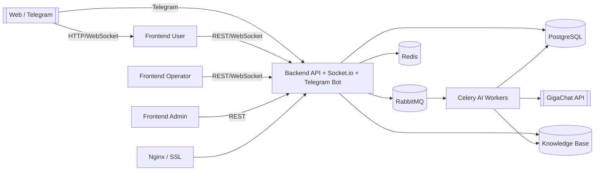
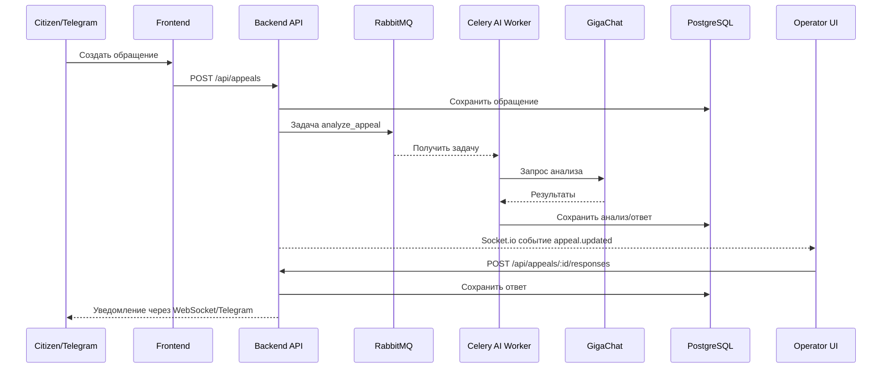

# 02 — Архитектура и потоки данных

Система построена как набор сервисов, связанных через HTTP, WebSocket и очередь RabbitMQ. Центральная логика живёт в Node.js backend, а долгие AI-задачи выполняют Celery workers на Python.

## 🧱 Основные компоненты

| Компонент | Технологии | Что делает |
| --- | --- | --- |
| Frontend (user/operator/admin) | React + TypeScript + Vite + Tailwind (`frontend/`) | Предоставляет три отдельных SPA, общающихся с API и WebSocket. |
| Backend API | Node.js 18, Express, Socket.io (`backend/src`) | REST API, авторизация, бизнес-логика обращений, WebSocket-канал для чатов и статусов. |
| Telegram Bot | node-telegram-bot-api (входит в backend) | Принимает обращения и сообщения из Telegram, синхронизирует их с системой. |
| Celery workers | Python 3, Celery, aiohttp (`workers/`) | Выполняют AI-анализ и генерацию ответов через GigaChat. |
| Очередь сообщений | RabbitMQ | Развязывает backend и workers, гарантирует доставку задач AI. |
| Хранилища | PostgreSQL 15, Redis 7 | PostgreSQL хранит основную модель данных; Redis служит кэшем и для сессий. |
| Гейтвей | Nginx (+ Let's Encrypt) | Маршрутизирует трафик к фронту/бекенду, терминирует SSL. |

Более детальная диаграмма находится в [ARCHITECTURE.md](../ARCHITECTURE.md). Ниже приведена визуализация взаимодействия основных сервисов.



## 🔁 Путь обращения

```
Web/Telegram → Backend API → PostgreSQL
              ↘ RabbitMQ → Celery → GigaChat → PostgreSQL
Backend → Socket.io → Frontend операторов (обновления в реальном времени)
```

1. **Создание**: гражданин отправляет форму → `/api/appeals` сохраняет данные и публикует задание `tasks.analyze_appeal`.
2. **AI-анализ**: worker обрабатывает запрос, обращается к GigaChat и обновляет `appeal_analysis` + подбирает статьи из `knowledge_base`.
3. **Оповещение**: backend пушит новые данные операторам через Socket.io и отображает подсказки.
4. **Ответ**: оператор редактирует AI-черновик → `POST /api/appeals/:id/responses` → сообщение уходит гражданину (WebSocket или Telegram).
5. **Автоматическое закрытие**: job следит за неактивными обращениями и меняет статус на `Завершено`.



## ⚙️ Сервисы и контейнеры

В `docker-compose.yml` описаны основные контейнеры: postgres, redis, rabbitmq, backend, три фронта, nginx, celery-worker, celery-beat, telegram-бот (как часть backend). Стандартный запуск поднимает 11 контейнеров (см. [QUICKSTART.md](../QUICKSTART.md)).

## 🔐 Интеграция с GigaChat

- Креды хранятся в `gigachat-config.json` (локально) или переменных окружения.
- Backend отправляет payloadы workers через RabbitMQ, чтобы не блокировать запросы.
- Подробную настройку см. в [GIGACHAT_SETUP.md](../GIGACHAT_SETUP.md) и `workers/gigachat_client.py`.

## 📡 Мониторинг и журналы

- Логи контейнеров доступны через `docker logs` или `docker-compose logs`.
- RabbitMQ имеет web-интерфейс (`rabbitmq-smartsupport.vadimevgrafov.ru`).
- Дополнительные инструменты описаны в [MONITORING.md](../MONITORING.md).
