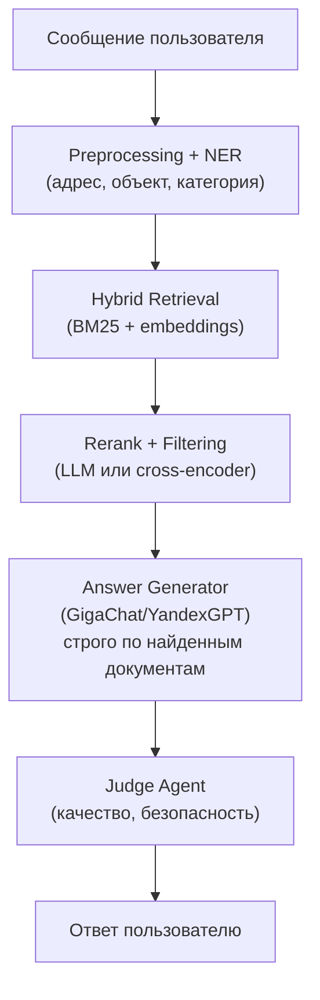

# 10. Алгоритмы и ИИ

**Навигация:** [Назад: Каналы и интеграции](09-integrations) | [Далее: Безопасность](11-security)

## Оглавление
- [Алгоритмы и ИИ](#алгоритмы-и-ии)
- [Архитектура ИИ в SmartSupport: RAG-first](#архитектура-ии-в-smartsupport-rag-first)
- [Схема RAG SmartSupport](#схема-rag-smartsupport)
- [Российские LLM как основной движок на этапе MVP](#российские-llm-как-основной-движок-на-этапе-mvp)
- [Метрики качества ИИ](#метрики-качества-ии)
- [Детект низкой уверенности](#детект-низкой-уверенности)
- [Логи диалогов как основной актив для будущего обучения](#логи-диалогов-как-основной-актив-для-будущего-обучения)
- [Анонимизация данных](#анонимизация-данных)
- [Модели для классификации обращений](#модели-для-классификации-обращений)
- [Будущее SmartSupport: собственные модели (этап 2–3)](#будущее-smartsupport-собственные-модели-этап-23)
- [Итоговая стратегия ИИ](#итоговая-стратегия-ии)

## Алгоритмы и ИИ 
SmartSupport использует современный подход к внедрению нейросетей: основа — RAG, а модели — инструмент поверх данных.

Это позволяет строить систему, которая работает надёжно, объяснимо, безопасно и может быть адаптирована для государственных учреждений и on-premise.

## Архитектура ИИ в SmartSupport: RAG-first
Главный принцип: ИИ не “придумывает” ответ — он извлекает и структурирует знания из базы знаний и регламентов.

Поэтому SmartSupport строится вокруг:
- мощной базы знаний (БЗ);
- векторного поиска;
- гибридного поиска (BM25 + embeddings);
- агентов, которые принимают решения на основе документов;
- российских LLM как движка генерации ответов на основе данных.

Зачем RAG-first:
- соответствие регламентам (важно для госов);
- отсутствие галлюцинаций;
- документированность каждого ответа;
- возможность on-prem (LLM может быть заменён или ограничен).

## Схема RAG SmartSupport

RAG остаётся основой системы — даже тогда, когда позже появятся smol-модели.

## Российские LLM как основной движок на этапе MVP
На ранних этапах SmartSupport использует:
- GigaChat
- YandexGPT
- Tolka / Yandex TextAI
- или любую LLM, разрешённую в РФ

для задач:
- формирование ответов на основе контекста;
- переформулировка;
- короткие уточнения;
- анализ обращений;
- суммаризация для Social Monitoring;
- генерация черновиков статей БЗ.

Почему это правильно:
- быстрый запуск;
- высокая точность;
- нет необходимости обучать модели;
- российские LLM уже оптимизированы для русского языка;
- полная совместимость с законодательством;
- снижение стоимости R&D.

## Метрики качества ИИ
SmartSupport оценивает качество по нескольким уровням:

Поиск
- RAG Recall
- RAG Precision
- Rerank Score

Генерация
- Judge Score
- Quality Score
- Confidence Score

Исполнение
- Auto-Resolution Rate (процент диалогов, закрытых ИИ)
- Operator Override Rate
- Knowledge Gap Rate

Безопасность
- Toxicity Score
- hallucination_penalty (от Judge Agent)

## Детект низкой уверенности
SmartSupport не “выдумывает” ответы. Если ИИ сомневается:
- просит уточнение,
- снижает уровень автоматизации,
- передаёт диалог оператору,
- отправляет сигнал о необходимости создания статьи БЗ.

Критерии низкой уверенности:
- низкий Confidence Score LLM;
- слабый RAG-контекст;
- конфликт Retrieval vs Generation;
- Judge Agent выставил штраф.

## Логи диалогов как основной актив для будущего обучения
SmartSupport хранит:
- диалоги в обезличенном виде;
- классификацию;
- признаки (NER);
- решения операторов;
- контекст RAG;
- Judge-оценки;
- сигналы Social Monitoring.

Эти данные — фундамент для будущего обучения моделей.

## Анонимизация данных
Для соответствия требованиям ИБ:
- удаляются ФИО, телефоны, адреса;
- заменяются ключевые сущности на маски;
- удаляются служебные идентификаторы;
- embeddings хранятся без PII.

## Модели для классификации обращений
На ранних этапах используются:
- российские LLM для классификации намерений;
- rule-based системы для регламентных случаев;
- embeddings + nearest neighbors для узкого домена (жкх/благоустройство/образование).

Позже:
- появится собственный классификатор на основе накопленных данных.

## Будущее SmartSupport: собственные модели (этап 2–3)
Это не MVP. Это следующая фаза развития, когда будут накоплены сотни тысяч обращений.

Собственные модели станут нужны, когда:
- появятся устойчивые нагрузки от госов;
- нужна будет полностью on-premise работа;
- стоимость запросов к LLM станет существенной;
- появится Municipal Dataset v1–v3.

Какие модели будут созданы:

1. SmartSupport-Router-Smol  
   (классификация намерений, 0.5B–1B)

2. SmartSupport-NER-Smol  
   (извлечение адресов/объектов, 1B–2B)

3. SmartSupport-Reply-Smol  
   (короткие ответы “как оператор”, 1.3B–3B)

4. SmartSupport-Summary-Smol  
   (аналитика и Social Monitoring)

5. SmartSupport-Reasoner-Smol  
   (опционально — для сложных рассуждений)

Но важный принцип:

Смол-модели — не на замену RAG, а как ускорители внутренних задач.

## Итоговая стратегия ИИ
SmartSupport следует моделям развития:

**Этап 1 — RAG + российские LLM (сейчас)**  
✔ максимальная достоверность  
✔ быстрое внедрение  
✔ низкая стоимость старта  
✔ работа по документам  
✔ поддержка on-prem  
✔ автоматизация до 70–90% типовых обращений  

**Этап 2 — модели классификации / NER (через накопление данных)**  
✔ автономия  
✔ высокая скорость  
✔ низкий инференс  
✔ улучшение качества классификации  

**Этап 3 — собственные smol-модели SmartSupport (позже)**  
✔ полный on-prem  
✔ снижение стоимости  
✔ кастомизация под регион/город  
✔ глубокое понимание домена  
✔ интеллектуальное автодополнение БЗ  

Главный вывод:

Сегодня SmartSupport = RAG-first + российские LLM. Собственные smol-модели — логичное развитие, но не часть MVP.
