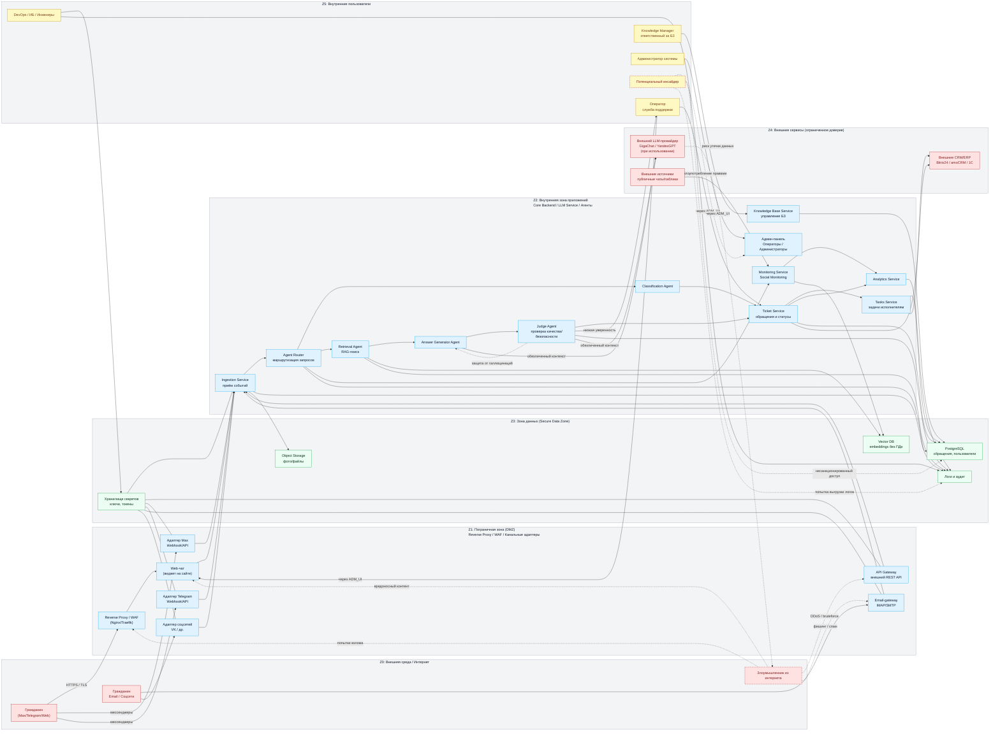

# 11. Безопасность и комплаенс

**Навигация:** [Назад: Алгоритмы и ИИ](10-ai) | [Далее: DevOps](12-devops)

## Оглавление
- [Безопасность и комплаенс](#безопасность-и-комплаенс)
- [Модель угроз SmartSupport](#модель-угроз-smartsupport)
- [Архитектура прав доступа](#архитектура-прав-доступа)
- [Работа с чувствительными данными](#работа-с-чувствительными-данными)
- [Анонимизация данных](#анонимизация-данных)
- [Требования государственных стандартов](#требования-государственных-стандартов)
- [Логи и аудит](#логи-и-аудит)
- [Политики хранения данных](#политики-хранения-данных)
- [Итог](#итог)

## Безопасность и комплаенс
Безопасность — один из ключевых уровней SmartSupport. Платформа проектируется с учётом:
- требований государственных заказчиков,
- требований к хранению и обработке персональных данных,
- наличия онлайн-чатов и многоканальной маршрутизации,
- использования ИИ-моделей,
- возможных угроз в публичной среде,
- on-premise развёртываний в закрытых периметрах.

SmartSupport поддерживает высокий уровень защищённости и прозрачности работы.

## Модель угроз SmartSupport
SmartSupport использует комплексную модель угроз, включающую:

**1. Угрозы внешнего контура**
- попытки несанкционированного доступа к API;
- перебор паролей / ключей;
- DDoS-атаки на веб-чат и каналы;
- подмена webhook-ов каналов (Telegram, Max);
- попытки внедрения вредоносных вложений (фото/видео/архивы).

**2. Угрозы внутреннего контура**
- компрометация учётных записей сотрудников;
- несанкционированное изменение БЗ;
- утечка персональных данных через операторов;
- злоупотребление правами администратора;
- ошибки конфигурации, приводящие к открытию систем наружу.

**3. Угрозы ИИ-слоя**
- галлюцинации, ведущие к неверным рекомендациям гражданам;
- использование ИИ для обхода ограничений;
- некорректная классификация обращения;
- раскрытие лишних данных при генерации ответа.

**4. Угрозы при интеграциях**
- перехват токенов;
- MITM-атаки в незащищённых сетях;
- несогласованность версий API;
- несоблюдение ограничений по данным при передаче во внешние системы.

## Архитектура прав доступа
SmartSupport использует строгую роль-based access control (RBAC) с возможностью расширения.

**Основные роли**
1. Оператор  
   - обработка обращений;  
   - взаимодействие с гражданами;  
   - корректировка ответов ИИ;  
   - просмотр необходимых данных.  
2. Старший оператор / модератор  
   - работа с очередями;  
   - контроль SLA;  
   - эскалация;  
   - доступ к аналитике.  
3. Knowledge Manager  
   - управление БЗ;  
   - публикация статей;  
   - утверждение изменений;  
   - работа с KB Curator Agent.  
4. Администратор системы  
   - настройка каналов;  
   - управление пользователями;  
   - доступ к логам;  
   - конфигурация интеграций.  
5. Технический администратор (DevOps/IT)  
   - доступ к настройкам контура;  
   - работа с журналами;  
   - управление ключами;  
   - развертывание обновлений.  
6. Интеграционный сервис / API-ключ  
   - минимальные права (самый строгий режим).  

**Принципы прав доступа**
- минимально необходимый доступ (Least Privilege);
- role isolation — роли не пересекаются;
- segregation of duties — операторы не должны управлять БЗ;
- операции с персональными данными логируются;
- канальные адаптеры работают с ограниченными токенами.

## Работа с чувствительными данными
SmartSupport учитывает требования по защите:
- ПДн;
- служебной информации;
- адресов;
- вложений;
- данных ЕСИА;
- пользовательских сообщений.

**Принципы обработки данных**
- данные граждан → хранятся только внутри страны;
- в логах → только обезличенная информация;
- в RAG → embeddings не содержат персональных данных;
- канальные интеграции → только по HTTPS/TLS 1.2+;
- в on-prem → работа без подключения к интернету;
- внешние LLM не получают ПДн (важно!).

## Анонимизация данных
Анонимизация встроена в систему на уровне:
- логирования;
- хранения обучающих данных;
- подготовки датасетов;
- Social Monitoring;
- аналитики обращений.

Удаляются / маскируются:
- ФИО → “Гражданин [ID]”;
- телефоны → “+7[mask]”;
- адреса → “улица [MASK], дом [MASK]”;
- координаты;
- номера паспортов, лицевых счетов, СНИЛС;
- идентификаторы ЕСИА.

Не уходит в LLM:
- персональные данные;
- вложения, содержащие ПДн;
- чувствительные данные о здоровье/семье;
- служебные номера.

Если используется внешний LLM — применяется LLM Privacy Filter.

## Требования государственных стандартов
SmartSupport соответствует требованиям:

**ФЗ-152 (Персональные данные)**  
- локализация данных в РФ;  
- защита канала;  
- сегментация доступа;  
- хранение ключей в защищённой среде.  

**ГОСТ Р 57580 (Комплексная защита финансовых/гос-систем)**  
- контроль целостности;  
- двухфакторная авторизация;  
- регулярный аудит;  
- защита каналов.  

**Приказы ФСТЭК по защите ИТС (режим ГИС)**  
- угрозы уровня 1/2;  
- защита от НСД;  
- изоляция сегментов;  
- аттестация контура (в случае on-prem).  

**GDPR (при работе с экспортом данных)**  
SmartSupport по умолчанию:  
- не отправляет данные за пределы РФ;  
- поддерживает экспорт в анонимизированном виде;  
- может работать в режиме “GDPR-compliant only”.  

## Логи и аудит
Система ведёт журнал:
- действий операторов;
- публикаций в БЗ;
- результатов Judge Agent;
- изменений прав;
- входов в систему;
- событий безопасности;
- интеграционных ошибок;
- прохождения цепочек агентов.

Возможности аудита:
- поиск по пользователю;
- фильтрация по каналу;
- просмотр всех действий за период;
- экспорт для ИБ-службы;
- подтверждение версий статей БЗ.

## Политики хранения данных
SmartSupport поддерживает раздельные политики хранения:

1. **Обращения и диалоги**  
   - по умолчанию: 12–36 месяцев;  
   - на гос-контуре может быть увеличено;  
   - архивирование в S3/Minio;  
   - физическое удаление по запросу ведомства.  
2. **Логи операторов**  
   - 12 месяцев;  
   - доступны только администраторам.  
3. **Вложения**  
   - хранятся отдельно от структурированных данных;  
   - удаляются вместе с обращениями;  
   - могут быть отключены для on-prem (по регламентам).  
4. **Embeddings / векторные данные**  
   - не содержат ПДн;  
   - срок хранения не ограничен.  
5. **Резервные копии**  
   - бэкапы PostgreSQL — ежедневно;  
   - бэкапы Minio — еженедельно;  
   - холодное хранение — 90–180 дней.  
6. **Данные для обучения моделей**  
   - только обезличенные;  
   - без вложений;  
   - без служебных данных;  
   - перед использованием проходит аудит ИБ.  

## Итог
SmartSupport обеспечивает:
- безопасность данных граждан;
- соответствие регуляциям РФ;
- защищённую мультиагентную архитектуру;
- прозрачный аудит;
- строгий RBAC;
- гибкие политики хранения;
- возможность полного on-premise развёртывания;
- гарантии отсутствия утечек при работе с LLM.

Это делает систему пригодной для:
- муниципалитетов;
- госорганов;
- МКУ;
- образовательных и социальных учреждений;
- крупных предприятий с повышенными требованиями ИБ.

## Диаграмма модели угроз

